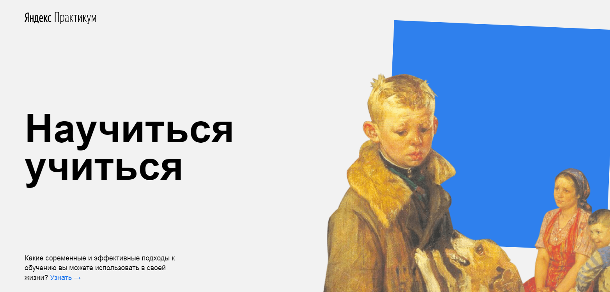

# Научиться учиться

В данной проектной работе, в отличие от предыдущей, используются более сложные технологии, такие как iframe или animation

**Во второй проектной работе были использованы технологии:** 
* flexbox 
* animation 
* iframe (добавление видео из ютуба - <https://www.youtube.com/watch?v=arj7oStGLkU> - <https://www.youtube.com/watch?v=5MgBikgcWnY)>

Для создания файловой структуры использовали методологию БЭМ (css и html)

